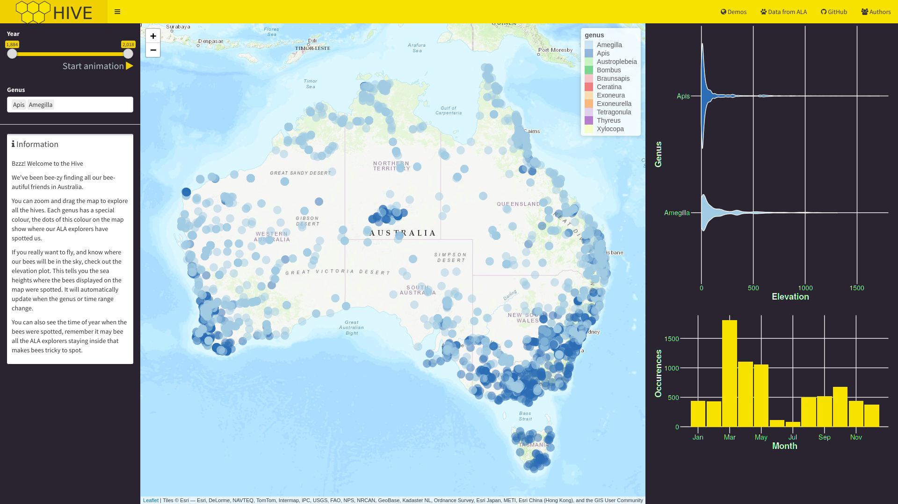

<!-- README.md is generated from README.Rmd. Please edit that file -->

```{r setup, include = FALSE}
knitr::opts_chunk$set(
  collapse = TRUE,
  comment = "#>"
)
```
# Hive

Team hive's entry to the useR!2018 datathon, exploring the varieties of bees in the Atlas of Living Australia.

To explore the diversity of bees, the app allows different areas of Australia to be viewed by panning and zooming the map. You can also filter out certain bee species to focus on the types of bees you're most interested in. You can also focus on a certain time period with the Year slider, and start an animation to visualise the change in bee sightings over time. The app also provides seasonal plots of sightings and violin plots of the altitude by each species.

# Usage

The shiny app can be started with this R code:

```{r run, eval = FALSE}
shiny::runGitHub("mitchelloharawild/hive", subdir = "shiny")
```



